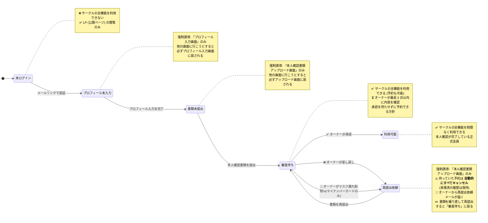

# 状態遷移図 — 会員登録と本人確認

## 目的

High Q の会員ジャーニーにおいて、**ユーザーの登録進捗** と **オーナー (admin) による本人確認書類の確認** がどのように連動して、ユーザーの **できること / できないこと** が変わるのかを 1 枚の図にまとめる。

## 全体像



---

## 各状態でできること・できないこと

| 状態 | サークルへの入会段階 | 予約できる? | アクセスできる画面 | 主な制約 |
|---|---|---|---|---|
| **未ログイン** | 入会前 | ❌ 不可 | LP のみ | ログインしない限りサークル機能は一切使えない |
| **プロフィール未入力** | ログイン直後 | ❌ 不可 | プロフィール入力画面のみ | 氏名 / 生年月日 / 電話 / 経験レベルなどを入れるまで先へ進めない |
| **書類未提出** | プロフィール入力後 | ❌ 不可 | 本人確認書類アップロード画面のみ | 本人確認書類 (運転免許証など) を出すまで先へ進めない |
| **審査待ち** | 書類提出済み | ✅ **可能** | サークル全機能 | オーナーの確認を待つ間も予約可。確認は最長 3 日以内 |
| **利用可能** | 本人確認完了 | ✅ 可能 | サークル全機能 | 制限なし。正式会員として運用 |
| **再提出依頼** | 差し戻し後 | ❌ 不可 | 本人確認書類アップロード画面のみ | **既存予約は自動キャンセル済み**。書類を出し直すまで予約できない |

---

## オーナー (admin) の操作と、ユーザーへの影響

オーナーは「審査待ち」状態のユーザーの書類に対して、以下 3 種類のいずれかの操作を行う。

### 1. ✅ 承認 (Approve)

書類が問題ない場合に行う。

| 項目 | 内容 |
|---|---|
| 条件 | 書類画像が鮮明・氏名 / 住所 / 生年月日が読み取れる・有効期限内 |
| 対象書類 | すべての書類種別 (10 種) |
| ユーザー側の状態変化 | 「審査待ち」→ **「利用可能」** |
| 既存予約への影響 | なし (そのまま active) |
| ユーザーへの通知 | (MVP1 ではメール通知なし。MVP2 で実装予定) |

### 2. ❌ 差し戻し (Reject)

書類に不備がある場合に行う。

| 項目 | 内容 |
|---|---|
| 条件 | 画像が不鮮明・氏名や住所が読み取れない・有効期限切れ・別の書類が必要等 |
| 対象書類 | すべての書類種別 (10 種) |
| 操作時にオーナーが入力するもの | 差し戻し理由 (1〜500 文字、必須) |
| ユーザー側の状態変化 | 「審査待ち」→ **「再提出依頼」** |
| 既存予約への影響 | ⚠️ **当該ユーザーの予約 (確定 / キャンセル待ち) はすべて自動キャンセル**。来場済の予約は履歴として保持 |
| ユーザーへの通知 | オーナーがメーラーから送信する再提出依頼メール (差し戻し理由 + キャンセル件数を含む) |

### 3. 🛑 マスク漏れ削除 (マイナンバーカード専用)

マイナンバーカード提出時に、個人番号 (裏面 12 桁) のマスクが不十分だった場合に行う緊急安全措置。

| 項目 | 内容 |
|---|---|
| 条件 | マイナンバーカード画像で個人番号 12 桁の全部または一部が読める |
| 対象書類 | **マイナンバーカードのみ** (他書類では本ボタンは表示されない) |
| 操作内容 | 画像を **オンラインストレージから完全削除** + 状態を「再提出依頼」へ |
| ユーザー側の状態変化 | 「審査待ち」→ **「再提出依頼」** |
| 既存予約への影響 | 差し戻しと同じ (active な予約は自動キャンセル) |
| ユーザーへの通知 | 「マイナンバーのマスクが不十分だったため画像を削除しました。再撮影してください」のテンプレート |

> **方針**: オーナーは少しでも個人番号が見えたら **安全側に倒して削除** する。判断に迷う場合は削除を選ぶ運用 (個人情報保護のため)。

---

## 「審査待ちでも予約可能」とした理由 (PO 判断)

この方針を採用したのは以下のトレードオフを考慮した結果:

| 観点 | 「審査待ち中は予約不可」案 (旧方針) | 「審査待ちでも予約可能」案 (採用) |
|---|---|---|
| ユーザー体験 | 入会してから初参加までに「オーナーの確認を待つ」摩擦が発生 | 提出直後から予約でき、初動の心理的ハードルが低い |
| イベント定員精度 | 常に「確認済みの人」だけがカウントされる | 差し戻し時に「実は来ない人」が定員にカウントされる期間が発生 |
| 運用負荷 | オーナーが急いで確認しないとユーザーが離脱 | オーナーは 3 日以内目標で確認すれば良い |
| 差し戻し時の整合性 | (発生しない) | **連鎖予約キャンセル** で自動的に整合性を担保 |

**結論**: 入会摩擦を最小化する方を選び、整合性は「差し戻し時の連鎖予約キャンセル + 再提出フロー強制誘導」のセットで自動的に担保する設計を採用した。

---

## 典型的なシナリオ例

### シナリオ A: スムーズに会員になるパターン (大半のケース想定)

```
[ユーザー] LP からログイン
   ↓
[ユーザー] プロフィール入力 → 本人確認書類 (運転免許証) を提出
   ↓ 「審査待ち」状態
[ユーザー] そのまま気になるイベントを予約 ← 予約可能
   ↓
[オーナー] 1〜2 日以内に書類を確認 → ✅ 承認
   ↓ 「利用可能」状態
[ユーザー] 当日来場、参加
```

### シナリオ B: 書類が不鮮明で差し戻されるパターン

```
[ユーザー] プロフィール + 書類 (運転免許証・暗くて文字が読めない) を提出
   ↓ 「審査待ち」状態
[ユーザー] イベント A を予約
   ↓
[オーナー] 書類を確認 → ❌ 差し戻し (理由: 「画像が暗く氏名が読めません」)
   ↓
   - イベント A の予約は自動キャンセル
   - 「再提出依頼」状態へ
   - オーナーから再提出依頼メールが届く
   ↓
[ユーザー] メールを見て、明るい場所で再撮影 → 再提出
   ↓ 「審査待ち」状態
[ユーザー] 改めてイベント A を予約 (まだ枠がある場合)
   ↓
[オーナー] ✅ 承認
   ↓ 「利用可能」状態
```

### シナリオ C: マイナンバーで個人番号が見えてしまったパターン

```
[ユーザー] マイナンバーカード (裏面の番号にマスキングテープを貼ったが端が見える) を提出
   ↓ 「審査待ち」状態
[オーナー] 画像を 4 倍ズームで確認 → 個人番号が読み取れる
   ↓ 🛑 マスク漏れ削除
   - 画像はオンラインストレージから即時完全削除
   - 「再提出依頼」状態へ
   - 既存予約があれば自動キャンセル
   - オーナーから再提出依頼メールが届く
[ユーザー] 個人番号を完全に隠して撮り直し → 再提出
   ↓ 「審査待ち」状態へ
[オーナー] 確認 → ✅ 承認
```

---

## 関連ドキュメント

- 本人確認書類の取り扱い (詳細運用 SOP): [`docs/06-品質・セキュリティ/08-本人確認書類取扱SOP.md`](../06-品質・セキュリティ/08-本人確認書類取扱SOP.md)
- 会員登録フロー (3 段階): `openspec/specs/reservation-identity-document-upload/spec.md`
- オーナー側レビュー画面の仕様: `openspec/specs/admin-identity-document-review/spec.md` (Issue #171 マージ後)
- 個人情報保護方針: [`docs/06-品質・セキュリティ/06-個人情報保護方針.md`](../06-品質・セキュリティ/06-個人情報保護方針.md)
