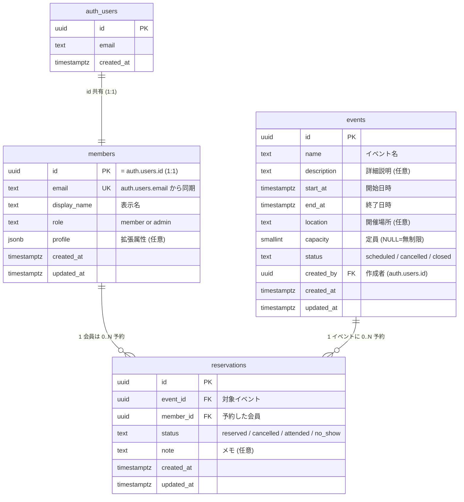

# 論理設計（DB） — Phase 1

> 関連: `openspec/changes/supabase-initial-schema/` （proposal / design / specs）
> Phase 1 で扱う 3 エンティティの論理モデル。物理設計（PostgreSQL 固有の型・インデックス・トリガー等）は `02-物理設計/物理設計.md` を参照。

---

## 1. 対象エンティティ

| エンティティ | 説明 | 主な利用者 |
|---|---|---|
| **会員 (Member)** | サークル参加者。Supabase Auth の利用者と 1:1 | 予約サイト / 管理画面 |
| **イベント (Event)** | 練習会・大会等の開催単位 | 予約サイト（公開） / 管理画面 / LP |
| **予約 (Reservation)** | 会員 × イベントの参加申込 | 予約サイト / 管理画面 |

## 2. ER 図



## 3. エンティティ詳細

### 3.1 members（会員）

| 属性 | 概念 | NULL 許可 | 一意 | 補足 |
|---|---|---|---|---|
| id | 会員識別子 | × | PK | `auth.users.id` と同一値 |
| email | メールアドレス | × | UK | 認証用。`auth.users.email` から初回同期 |
| display_name | 表示名 | × | - | LP / 予約サイトでの表示名（本名でも nick でも可） |
| role | 権限ロール | × | - | `member`（デフォルト） / `admin` |
| profile | 拡張属性 | × | - | 任意 jsonb（`{}` がデフォルト）。例: 経験年数、ポジション希望 |
| created_at | 作成日時 | × | - | now() |
| updated_at | 更新日時 | × | - | 行更新時に自動セット |

**ビジネスルール**:
- 1 つの auth.users に対し members は必ず 1 件存在する（サインアップ時にトリガーで自動 INSERT）
- `role = 'admin'` の昇格は SQL 直書き運用（Phase 1 暫定、UI なし）
- マイナンバー / 個人番号は **絶対に保存しない**（profile に格納することも禁止）

### 3.2 events（イベント）

| 属性 | 概念 | NULL 許可 | 一意 | 補足 |
|---|---|---|---|---|
| id | イベント識別子 | × | PK | UUID v4 |
| name | イベント名 | × | - | 例: "5月練習会 #1" |
| description | 詳細 | ○ | - | 任意の説明文 |
| start_at | 開始日時 | × | - | timestamptz |
| end_at | 終了日時 | × | - | timestamptz、必ず start_at より後 |
| location | 開催場所 | ○ | - | 例: "深川北スポーツセンター 第2体育室" |
| capacity | 定員 | ○ | - | smallint。NULL = 無制限、正数のみ許可 |
| status | 開催状態 | × | - | `scheduled`（既定） / `cancelled` / `closed` |
| created_by | 作成者 | ○ | - | auth.users.id（管理者のみ作成可） |
| created_at | 作成日時 | × | - | now() |
| updated_at | 更新日時 | × | - | 自動 |

**ビジネスルール**:
- 開始 < 終了は DB 側で CHECK 制約
- capacity は NULL（無制限） or 1 以上の正数
- 一般会員は閲覧のみ。作成・編集・削除は管理者のみ（RLS）

### 3.3 reservations（予約）

| 属性 | 概念 | NULL 許可 | 一意 | 補足 |
|---|---|---|---|---|
| id | 予約識別子 | × | PK | UUID v4 |
| event_id | 対象イベント | × | UK(複合) | events.id への FK |
| member_id | 予約者 | × | UK(複合) | members.id への FK |
| status | 予約状態 | × | - | `reserved`（既定） / `cancelled` / `attended` / `no_show` |
| note | メモ | ○ | - | 任意（例: "初参加" 等の管理メモ） |
| created_at | 作成日時 | × | - | now() |
| updated_at | 更新日時 | × | - | 自動 |

**ビジネスルール**:
- (event_id, member_id) で複合 UNIQUE。1 イベント・1 会員につき 1 行のみ
- キャンセル後の再予約は同じ行の `status` を `'reserved'` に戻して表現（履歴は updated_at のみ）
- 一般会員は自分の予約のみ閲覧・キャンセル可能。出席判定（attended / no_show）は管理者のみ

## 4. リレーション

| 関係 | 多重度 | 削除時動作 |
|---|---|---|
| auth.users — members | 1 — 1 | auth.users 削除時、members の対応行も削除（CASCADE） |
| members — reservations | 1 — 0..N | members 削除を **RESTRICT**（予約履歴を残すため） |
| events — reservations | 1 — 0..N | events 削除を **RESTRICT**（同上） |

## 5. 状態遷移

### 5.1 events.status

```
scheduled  → cancelled  (管理者がキャンセル)
scheduled  → closed     (開催済み・受付終了)
cancelled  → scheduled  (誤操作の取消・管理者のみ)
```

### 5.2 reservations.status

```
reserved   → cancelled  (会員 or 管理者がキャンセル)
reserved   → attended   (管理者が出席記録)
reserved   → no_show    (管理者が欠席記録)
cancelled  → reserved   (会員が再予約)
```

## 6. 設計判断のメモ

- **会員と認証の関係**: Supabase Auth 標準の `auth.users` を踏襲。members は拡張属性置き場として 1:1 で紐付く（FK 兼 PK で同一 UUID）
- **予約履歴の保持**: Phase 1 では「キャンセル → 再予約」は同じ行の status 更新で表現。履歴を時系列で全保持する必要が出たら Phase 2 で `reservations_history` を別出し
- **定員超過チェック**: アプリ層で実施（Phase 1）。同時申込のレースコンディションは規模上許容、Phase 2 で advisory lock 検討
- **ソフトデリート不採用**: `status = cancelled` で論理削除に相当する状態を表現するため、DELETE は基本使わない設計

## 7. 物理設計への引き継ぎ事項

`02-物理設計/物理設計.md` で以下を確定する:

- 各列の PostgreSQL 型・サイズ・デフォルト値
- インデックス設計（events.start_at の B-tree、reservations の (member_id, status) 複合等）
- CHECK 制約・FK の ON DELETE 動作
- `set_updated_at()` トリガーと `is_admin()` 関数
- RLS ポリシーの SQL（詳細は `openspec/changes/supabase-initial-schema/specs/rls-policies/spec.md`）
