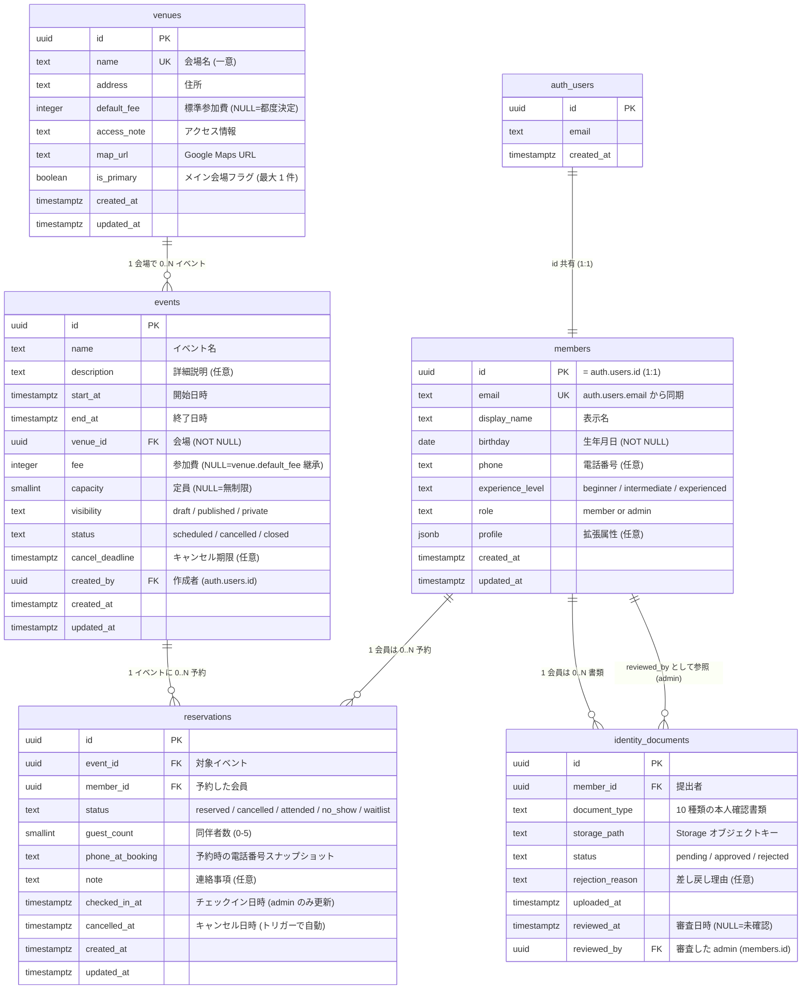

# 論理設計（DB） — Phase 1

> 関連:
> - 初期スキーマ: `openspec/changes/archive/2026-04-26-supabase-initial-schema/`
> - スキーマ拡張 (#147): `openspec/changes/db-schema-foundation/`
>
> Phase 1 で扱う 5 エンティティの論理モデル。物理設計（PostgreSQL 固有の型・インデックス・トリガー等）は `02-物理設計/物理設計.md` を参照。

---

## 1. 対象エンティティ

| エンティティ | 説明 | 主な利用者 |
|---|---|---|
| **会員 (Member)** | サークル参加者。Supabase Auth の利用者と 1:1 | 予約サイト / 管理画面 |
| **会場 (Venue)** | イベント開催地のマスタ | 管理画面（CRUD） / LP（参照） / 予約サイト（参照） |
| **イベント (Event)** | 練習会・大会等の開催単位 | 予約サイト（公開） / 管理画面 / LP |
| **予約 (Reservation)** | 会員 × イベントの参加申込 | 予約サイト / 管理画面 |
| **本人確認書類 (IdentityDocument)** | 参加者の安全 + 役所への団体登録の証憑 | 予約サイト（提出） / 管理画面（審査） |

## 2. ER 図



## 3. エンティティ詳細

### 3.1 members（会員）

| 属性 | 概念 | NULL 許可 | 一意 | 補足 |
|---|---|---|---|---|
| id | 会員識別子 | × | PK | `auth.users.id` と同一値 |
| email | メールアドレス | × | UK | 認証用。`auth.users.email` から初回同期 |
| display_name | 表示名 | × | - | 本名 or ニックネーム可 |
| birthday | 生年月日 | × | - | サインアップ直後は placeholder (current_date)、登録フォーム送信時に正式値で UPDATE |
| phone | 電話番号 | ○ | - | 当日連絡用 |
| experience_level | 経験レベル | × | - | `beginner`（既定） / `intermediate` / `experienced` |
| role | 権限ロール | × | - | `member`（既定） / `admin` |
| profile | 拡張属性 | × | - | jsonb（`{}` がデフォルト） |
| created_at / updated_at | 監査 | × | - | now() / トリガー自動 |

**ビジネスルール**:
- 1 つの auth.users に対し members は必ず 1 件存在する
- `role = 'admin'` の昇格は SQL 直書き運用（管理者ブートストラップ手順 SOP 参照）
- マイナンバー個人番号 12 桁を**テキストとして保存することは禁止**（マスク済み画像は identity_documents に Storage 経由で保管可）

### 3.2 venues（会場マスタ）

| 属性 | 概念 | NULL 許可 | 一意 | 補足 |
|---|---|---|---|---|
| id | 会場識別子 | × | PK | UUID v4 |
| name | 会場名 | × | UK | 一意（重複防止） |
| address | 住所 | ○ | - | 公開可能な住所 |
| default_fee | 標準参加費 | ○ | - | 円。NULL は都度決定 |
| access_note | アクセス情報 | ○ | - | 駅徒歩・駐車場など |
| map_url | 地図 URL | ○ | - | Google Maps 等 |
| is_primary | メイン会場 | × | - | partial unique で最大 1 件 |
| created_at / updated_at | 監査 | × | - | now() / トリガー自動 |

**ビジネスルール**:
- メイン会場フラグは最大 1 件（partial unique index `venues_single_primary_idx`）
- 一般ユーザーは SELECT のみ可、CRUD は admin のみ
- **有明会場は学校名を保管しない**：name=`'有明会場'`、address はゆりかもめ駅住所のみ。実会場（近隣の小学校）は予約確定メール（#148）で個別通知（design.md D9.1）

**初期 seed (5 行)**:

| name | address | default_fee | is_primary |
|---|---|---|---|
| 亀戸スポーツセンター | 江東区亀戸 8-22-1 | 1000 | false |
| 東砂スポーツセンター | 江東区東砂 4-24-1 | 1000 | false |
| 深川スポーツセンター | 江東区越中島 1-2-18 | 1000 | false |
| 深川北スポーツセンター | 江東区平野 3-2-20 | 1000 | false |
| 有明会場 | 江東区有明 1-8-14 先 | 500 | **true** |

### 3.3 events（イベント）

| 属性 | 概念 | NULL 許可 | 一意 | 補足 |
|---|---|---|---|---|
| id | イベント識別子 | × | PK | UUID v4 |
| name | イベント名 | × | - | 例: "ゆる練 vol.43" |
| description | 詳細 | ○ | - | markdown |
| start_at | 開始日時 | × | - | timestamptz |
| end_at | 終了日時 | × | - | start_at より後 |
| venue_id | 会場 | × | - | venues.id への FK（NOT NULL） |
| fee | 参加費 | ○ | - | NULL は venue.default_fee 継承 |
| capacity | 定員 | ○ | - | smallint。NULL = 無制限 |
| visibility | 公開ステータス | × | - | `draft`（既定） / `published` / `private` |
| status | 実施ステータス | × | - | `scheduled`（既定） / `cancelled` / `closed` |
| cancel_deadline | キャンセル期限 | ○ | - | 任意 |
| created_by | 作成者 | ○ | - | auth.users.id |
| created_at / updated_at | 監査 | × | - | now() / トリガー自動 |

**ビジネスルール**:
- 開始 < 終了は DB CHECK 制約
- capacity は NULL（無制限） or 1 以上の正数
- venue_id 必須（venues seed 投入後にのみ events を作成可）
- visibility と status は独立（"公開済みだが中止" のような状態を表現可能）
- 一般会員は visibility=`'published'` のみ閲覧可。CRUD は admin のみ

### 3.4 reservations（予約）

| 属性 | 概念 | NULL 許可 | 一意 | 補足 |
|---|---|---|---|---|
| id | 予約識別子 | × | PK | UUID v4 |
| event_id | 対象イベント | × | UK(複合) | events.id への FK |
| member_id | 予約者 | × | UK(複合) | members.id への FK |
| status | 予約状態 | × | - | 5 値（waitlist 含む） |
| guest_count | 同伴者数 | × | - | 0-5（CHECK 制約） |
| phone_at_booking | 電話番号スナップショット | ○ | - | 当日連絡用、予約時点の値 |
| note | 連絡事項 | ○ | - | アレルギー等 |
| checked_in_at | チェックイン | ○ | - | NULL=未チェックイン、admin のみ更新 |
| cancelled_at | キャンセル日時 | ○ | - | status='cancelled' 遷移時にトリガーで自動セット |
| created_at / updated_at | 監査 | × | - | now() / トリガー自動 |

**ビジネスルール**:
- (event_id, member_id) で複合 UNIQUE
- キャンセル後の再予約は同じ行の status を `'reserved'` に戻して表現
- 一般会員は自分の予約のみ閲覧・キャンセル可能。出席判定（attended / no_show）はadmin のみ
- waitlist は #154（キャンセル待ち管理・MVP2）で運用開始

### 3.5 identity_documents（本人確認書類）

| 属性 | 概念 | NULL 許可 | 一意 | 補足 |
|---|---|---|---|---|
| id | 書類識別子 | × | PK | UUID v4 |
| member_id | 提出者 | × | - | members.id への FK（ON DELETE CASCADE） |
| document_type | 書類種別 | × | - | 10 種類の enum（CHECK 制約） |
| storage_path | 画像パス | × | - | Storage 内のキー |
| status | 審査状態 | × | - | `pending`（既定） / `approved` / `rejected` |
| rejection_reason | 差し戻し理由 | ○ | - | status='rejected' 時に入力 |
| uploaded_at | 提出日時 | × | - | now() |
| reviewed_at | 審査日時 | ○ | - | NULL=未確認 |
| reviewed_by | 審査した admin | ○ | - | members.id (FK SET NULL) |

**書類種別 enum (10 値)**:
`drivers_license` / `driving_history_cert` / `residence_certificate` / `disability_certificate` / `residence_card` / `special_permanent_resident_cert` / `student_id` / `passport` / `my_number_card_masked` / `health_insurance_cert`

**ビジネスルール**:
- 自分の書類のみ閲覧・削除可。admin は全件閲覧可
- status / rejection_reason / reviewed_* は admin のみ UPDATE 可（自己承認禁止）
- マイナンバーカードは個人番号マスク済みのみ受付。詳細は [docs/06-品質・セキュリティ/08-本人確認書類取扱SOP.md](../../../06-品質・セキュリティ/08-本人確認書類取扱SOP.md)
- 画像本体は Storage バケット `identity-documents`（private）にパス命名 `<member_id>/<document_id>-(front|back).(jpg|png|heic)` で保管

## 4. リレーション

| 関係 | 多重度 | 削除時動作 |
|---|---|---|
| auth.users — members | 1 — 1 | auth.users 削除時、members も削除（CASCADE） |
| members — reservations | 1 — 0..N | members 削除を **RESTRICT**（予約履歴を残す） |
| members — identity_documents (member_id) | 1 — 0..N | members 削除時、書類も削除（CASCADE）。Storage 側はアプリ層で別途削除 |
| members — identity_documents (reviewed_by) | 1 — 0..N | members 削除時、reviewed_by を NULL に SET NULL |
| events — reservations | 1 — 0..N | events 削除を **RESTRICT** |
| venues — events | 1 — 0..N | venues 削除を **RESTRICT**（events が参照中は削除不可） |

## 5. 状態遷移

### 5.1 events.visibility

```
draft       → published   (admin が公開)
draft       → private     (限定公開化)
published   → private     (一時非公開化)
published   → draft        (取下げ)
```

### 5.2 events.status

```
scheduled  → cancelled  (admin がキャンセル)
scheduled  → closed     (開催済み・受付終了)
```

### 5.3 reservations.status

```
reserved   → cancelled  (member or admin がキャンセル — トリガーで cancelled_at 自動)
reserved   → attended   (admin が出席記録)
reserved   → no_show    (admin が欠席記録)
reserved   → waitlist   (定員超過 — MVP2)
waitlist   → reserved   (キャンセル発生時の繰上げ — MVP2)
cancelled  → reserved   (再予約)
```

### 5.4 identity_documents.status

```
pending    → approved   (admin が承認)
pending    → rejected   (admin が差し戻し — rejection_reason 必須)
rejected   → pending    (member が再アップロードで storage_path 更新)
```

## 6. 設計判断のメモ

- **会員と認証の関係**: Supabase Auth 標準の `auth.users` を踏襲。members は拡張属性置き場として 1:1 で紐付く（FK 兼 PK で同一 UUID）
- **予約履歴の保持**: Phase 1 では「キャンセル → 再予約」は同じ行の status 更新で表現
- **定員超過チェック**: アプリ層で実施（Phase 1）。同時申込のレースコンディションは規模上許容、Phase 2 で advisory lock 検討
- **ソフトデリート不採用**: `status = cancelled` で論理削除を表現
- **会場マスタ化（#147 で追加）**: 既存 events.location 列を DROP し venue_id NOT NULL FK で一本化（design.md D3）。本番 DB が空のうちに厳しく縛る判断
- **公開ステータス分離（#147 で追加）**: events.visibility と status を独立列にし、"公開済みだが中止" のような状態を表現可能（design.md D2）
- **マイナンバー方針切替（#147 で追加）**: 旧来の "収集禁止" を "個人番号マスク済み画像のみ受付" に変更（design.md D8）

## 7. 物理設計への引き継ぎ事項

`02-物理設計/物理設計.md` で以下を確定する:

- 各列の PostgreSQL 型・サイズ・デフォルト値
- インデックス設計（events.start_at / events.venue_id / reservations の複合等）
- CHECK 制約・FK の ON DELETE 動作
- `set_updated_at()` / `set_reservations_cancelled_at()` トリガーと `is_admin()` 関数
- RLS ポリシーの SQL（詳細は [openspec/specs/rls-policies/spec.md](../../../../openspec/specs/rls-policies/spec.md)）
- Storage バケット `identity-documents` の RLS
