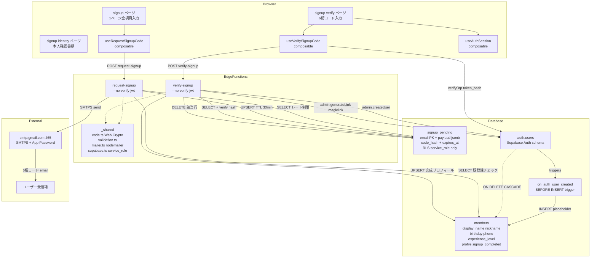
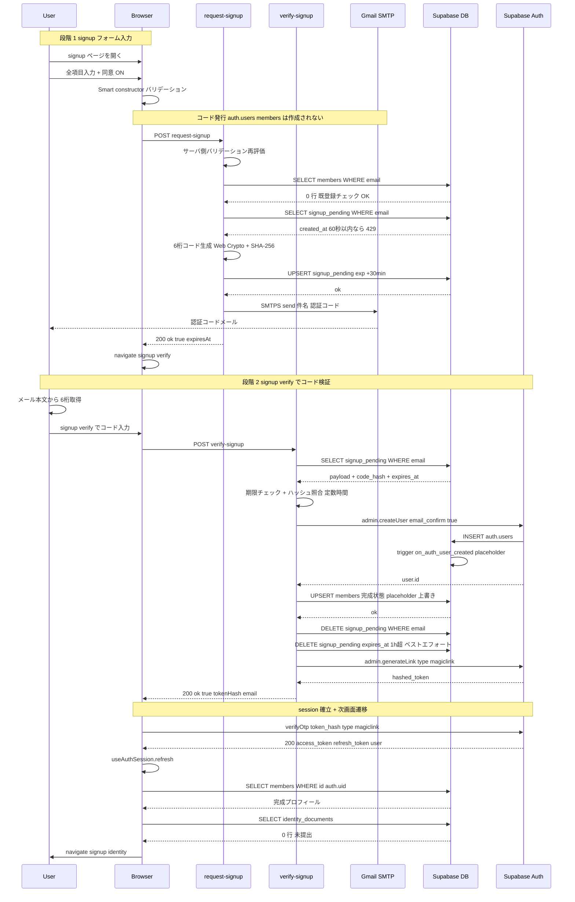
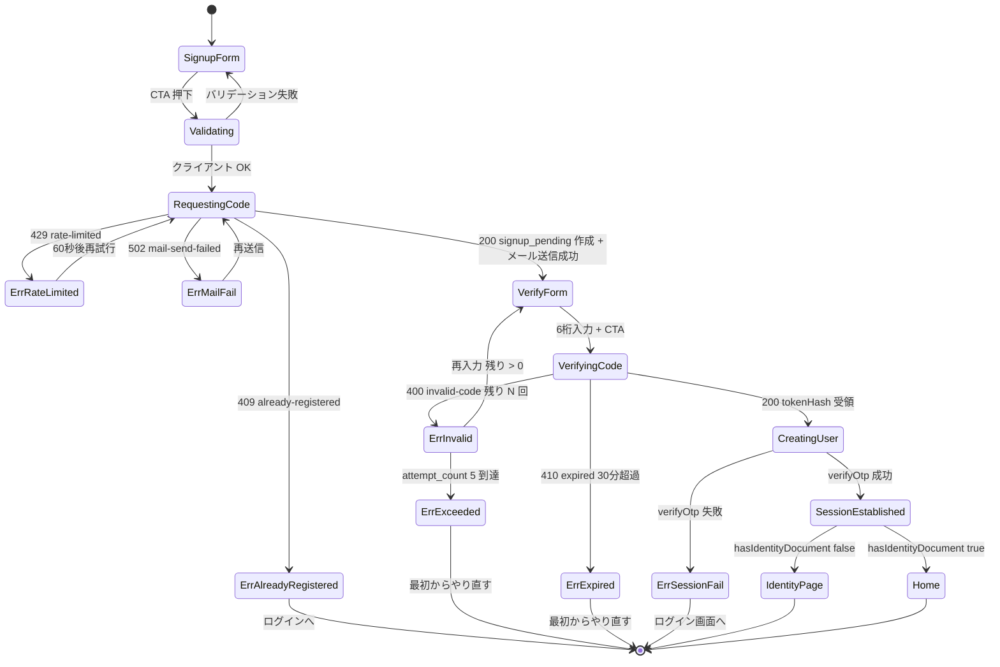
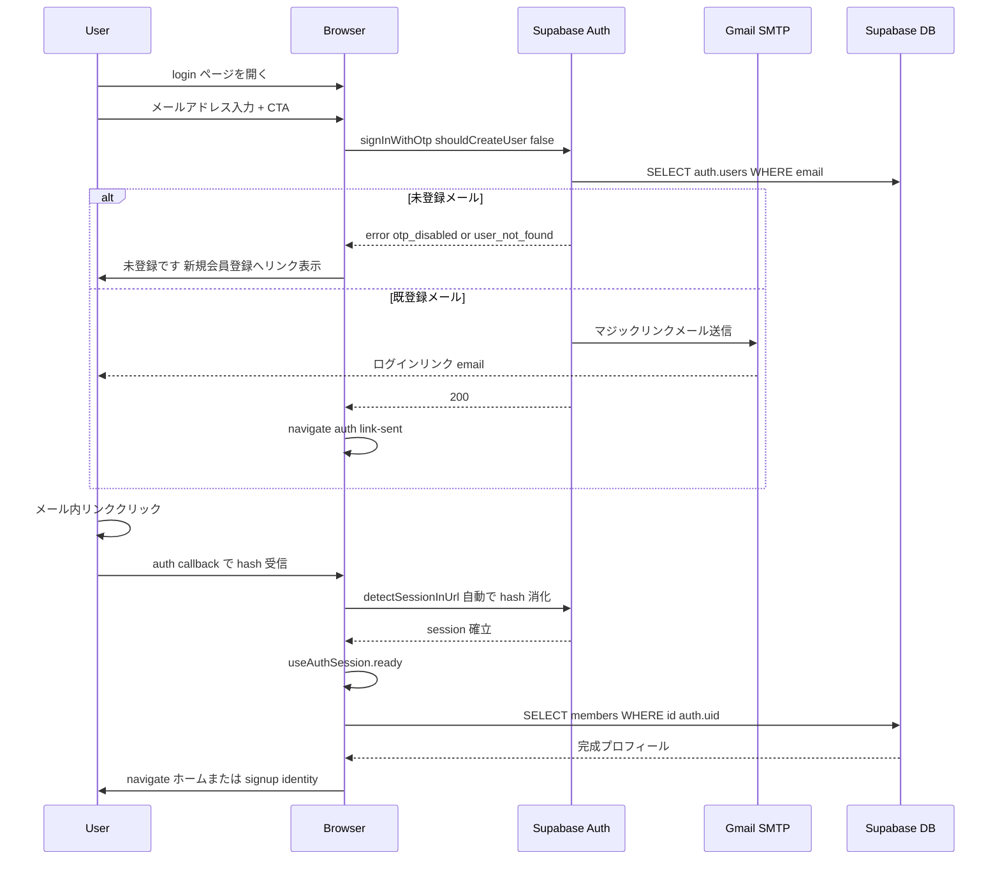

# 会員登録・ログイン アーキテクチャ / シーケンス図

最終更新: 2026-05-11（#189 ゼロ滞留 signup フロー導入時）

関連 spec / change:
- `openspec/specs/reservation-member-auth/spec.md`
- `openspec/specs/data-schema/spec.md`（`signup_pending` テーブル）
- `openspec/specs/rls-policies/spec.md`（`signup_pending` の service_role 限定 RLS）
- `openspec/changes/archive/2026-05-10-reservation-signup-zero-stale/`

## 設計の核心（なぜこの形か）

Phase 1 で採用していた Supabase 標準のマジックリンク方式（`signInWithOtp({ shouldCreateUser: true })`）は、API 呼び出し時点で `auth.users` 行を作成する仕様だった。メール無視 / プロフィール入力で離脱したユーザーが auth.users / members に滞留する問題があり、これをサービスIN前に **Edge Function + 6 桁コード方式** で根本解決した（#189）。

**不変条件**: `auth.users` / `members` への INSERT は `verify-signup` Edge Function 成功時の唯一の経路に集約される。中途離脱者の痕跡は `signup_pending` テーブル（TTL 30 分）にしか残らない。

## 1. アーキテクチャ図

## 2. シーケンス図 - 新規会員登録ハッピーパス

## 3. エラーパス状態遷移図

## 4. シーケンス図 - 既存会員ログイン（マジックリンク方式は維持）

#189 で signup フローのみ Edge Function + 6 桁コード方式に置き換え、ログインは Phase 1 のマジックリンク方式を維持している。

## 主要な設計判断（design.md より要約）

| 判断 | 内容 | 出典 |
|---|---|---|
| Edge Function + 自前 6桁コード | Supabase 標準 OTP は auth.users 即作成のため不可。Edge Function 2 本で自前構築 | D1 |
| 1ページ全項目入力 | 2 段階だと中途離脱滞留が再発し要件矛盾 | D2 |
| signup_pending + 30分 TTL | コードハッシュ保管・期限切れ即削除・ベストエフォート掃除 | D3 |
| Gmail SMTP via nodemailer | denomailer の UTF-8 ヘッダー化けを回避。`npm:nodemailer@6.9.16` | D4 |
| ログインは現行据え置き | 中途滞留問題はログインで発生しないため変更最小化 | D5 |
| auth guard 簡素化 | プロフィール未完成分岐は到達不能のため削除 | D7 |

## 関連ドキュメント

- インフラ構成: `docs/03-アーキテクチャ/03-インフラ・CICD構成.md`「Supabase Edge Functions」
- アクセス制御: `docs/06-品質・セキュリティ/03-アクセス制御・認可設計.md`「3.4 signup_pending」
- メール送信運用: `docs/06-品質・セキュリティ/10-メール送信設定SOP.md`

## Mermaid 構文上の注意

GitHub Mermaid プレビューは厳格なため、本ドキュメントの図は以下の原則で書かれている。編集時に違反するとパースエラーになる:

- ノードラベルは必ずダブルクォートで囲む（`Node["label"]`）
- スラッシュ `/` はラベル内でも避ける（Mermaid のシェイプ delimiter と衝突）
- subgraph タイトルは単純識別子のみ（クォート・括弧なし）
- classDef は使用しない（予約語衝突リスク）
- 多行ラベルは ` ` 区切り（` ` は不可）
- 半角括弧 `( )` / 半角コロン `:` は極力削除
