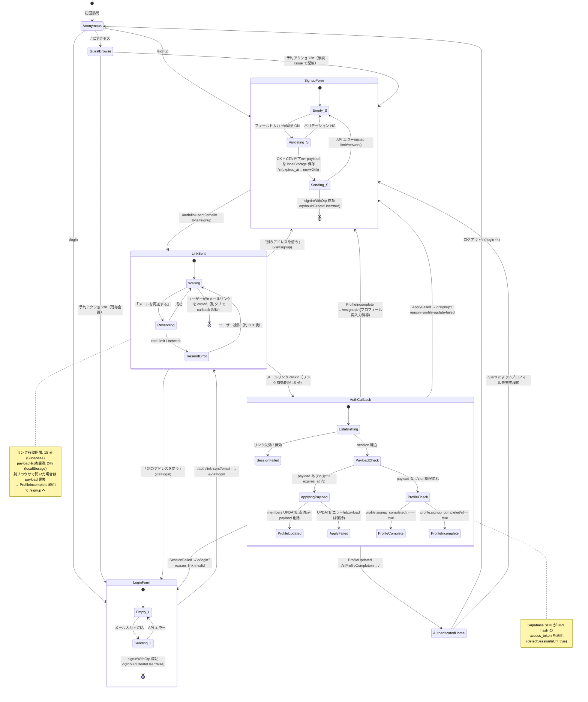

## Context

`apps/reservation` は `admin-reservation-ui-foundation` change で以下の土台が整備されている:

- Vue Router（`src/app/router.ts`）と最低 2 ルート（`/`, `/login` プレースホルダ）+ `// TODO: auth guard` コメント
- Tailwind preset（`@high-q/tailwind-preset`）と HQ デザイントークン（`var(--hq-*)`）
- `@high-q/ui` プリミティブ（`Button` / `Kicker` 等）
- shadcn-vue プリミティブ（`Input` / `Label` / `FormField` を `apps/reservation/src/shared/ui/` に取り込み済み）
- Supabase クライアント（`packages/shared/src/api/supabase.ts` の `createSupabaseClient`）— `persistSession: true`, `autoRefreshToken: true`, `detectSessionInUrl: true` で構築済み（admin で本番動作実績あり）

DB 側は `supabase-initial-schema` / `db-schema-foundation` change で:

- `members` テーブル（`display_name` / `birthday` / `phone` / `experience_level` / `role` / `profile` jsonb）
- `on_auth_user_created` トリガー（auth.users INSERT で `display_name = ''` / `birthday = current_date` の placeholder 行を自動作成）
- 既存 RLS: members は **自分の行のみ SELECT/UPDATE 可、role 列の自己昇格は WITH CHECK で拒否、INSERT は trigger 経由のみ**

admin (#84) で確立した認証パターン（マジックリンク + `useAuthSession` composable + auth guard）を **reservation 側にコピー&スリム化** する形で実装する。会員ロールは admin と異なり高権限ではないため、MFA / AAL2 強制 / idle timeout は **不要**（Phase 2 で再評価）。代わりに「**プロフィール完成判定**」という会員固有の guard が必要（trigger が作る placeholder 行のままでは予約フローが成立しないため）。

Issue #170 (Epic) のユーザージャーニー上、本 change は「登録する」「探す」の境界に位置する。`/` イベント一覧は **未認証でも閲覧可**（`meta.public = true`）とし、予約アクション（後続 #91）に達した時点で `/login` または `/signup` へ誘導する設計。本 change ではゲスト閲覧の境界線（meta.public）の定義までを担当し、予約アクションの guard は #91 で配線する。

Phase 1 リリースは 2026-05-08。本 change はそれ以降に積まれる予約サイト機能（イベント詳細・予約フォーム・予約履歴等）すべての前提となるため、認可レイヤーとプロフィール作成フローが正しく機能することが最優先。

## Goals / Non-Goals

**Goals:**

- マジックリンクで会員登録・ログイン・ログアウトができる
- マジックリンク有効期限切れ時に「リンクの有効期限が切れたか、無効です。再送信してください」が表示され、再送信できる
- 会員登録フォームで `members` の placeholder 行が氏名 / 生年月日 / **電話（必須）** / 経験レベルで上書きされる
- 利用規約・プライバシーポリシー同意のタイムスタンプが `members.profile.terms_agreed_at` に保存される
- 認証済み + プロフィール完成済みの会員が `/` に到達できる
- 認証済み + プロフィール未完成の会員（trigger 直後など）は自動で `/signup` に誘導される
- 未認証ユーザーは `/`（イベント一覧）を閲覧できるが、予約ルート（後続）にアクセスすれば `/login` にリダイレクト
- ログアウトでセッションがクリアされ、保護ルートにアクセスすれば `/login` に戻る
- セッションは Supabase が `localStorage` に永続化し、ブラウザ再訪時に自動復元
- 4 状態（Loading / Empty / Error / Success）が Signup / Login / LinkSent / AuthCallback の UI で明示される
- E2E のハッピーパスとリダイレクト edge case が Playwright でカバーされる
- composable・guard・UI コンポーネント・Smart constructor が TDD で実装され、Vitest でユニットテスト通過

**Non-Goals:**

- パスワード認証 / SSO（マジックリンクのみ）
- パスワード忘却・再発行フロー（パスワードを使わないため不要）
- TOTP / WebAuthn / Passkey ベースの MFA（Phase 2 で再評価）
- **SMS 認証（電話番号の実在確認）**（Phase 2 で再評価。詳細は D13 参照）
- **本人確認書類アップロード（identity_documents）の必須化**（別 Issue で扱う。本 change では電話番号必須化までで止める）
- idle timeout（admin と異なり高権限操作がないため Phase 2 まで不要）
- 複数オーナー / role 切替 UI（会員はすべて `role = 'member'`、`admin` は Supabase Dashboard で手動付与のため UI 不要）
- ヘッダー・サイドナビ・本格的なログアウト UI（後続 dashboard Issue）
- メールテンプレートのカスタムデザイン（Supabase デフォルトを利用、admin と共通）
- リフレッシュトークンの自前ローテーション（Supabase SDK 任せ）
- プロフィール編集ページ（本 change は **作成のみ**。編集は #92 のプロフィール画面 Issue で実装）
- イベント一覧 / 詳細 / 予約フォームの本実装（#90 / #91）
- 通知設定 / 統計（MVP2 範囲、#170 参照）
- 利用規約・プライバシーポリシー本文の作成（テキスト確定は別途。本 change は同意 UI と timestamp 保存のみ）

## Decisions

### D1. 認証方式 = `signInWithOtp` (Magic Link)

**選択**: Supabase Auth の `signInWithOtp({ email, options: { emailRedirectTo, shouldCreateUser } })`。

- **Login** (`/login`): `shouldCreateUser: false`（既存会員のみ）
- **Signup** (`/signup`): `shouldCreateUser: true`（新規 auth.users + 連動して trigger が members placeholder 行作成）

**Rationale**:

- パスワードレスで会員の UX 摩擦最小化（admin と同じ判断）
- Supabase 標準 SDK のみで完結、追加依存なし
- admin で本番動作実績あり、運用知見を再利用できる

**代替**:

- ❌ Email + Password: 忘却・リセット運用が増える、UX 摩擦が大きい
- ❌ OAuth (Google): Provider 設定が追加で必要。MVP1 では過剰
- ❌ OTP（数字入力）: マジックリンクと比較して UX が劣る

### D2. signup フローの搬送 = **不要（D7 改訂により撤廃）**

**選択（2026-05-02 翔太郎くん指示で改訂）**: localStorage payload 経由の搬送は **撤廃**。

**Rationale**:

- D7 改訂により signup を 2 段階フロー（メール送信 → 情報入力）に変更したため、情報をクライアント側で運ぶ必要がなくなった
- 利点: PII（氏名・電話・生年月日）の localStorage 保管リスクが消滅、別ブラウザでの payload 喪失問題も発生しない
- 欠点: メール認証後にユーザーが情報入力を放棄した場合、`auth.users` (confirmed) + `members` placeholder が滞留する → D3.1 の cleanup ジョブ（48h）で回収

**当初設計（2026-05-02 取消）**:
~~`localStorage[signup-pending-<email>]` に JSON で保存して 24h 自動失効~~

### D3. プロフィール完成判定 = `profile.signup_completed === true` **OR** `role === 'admin'`

**選択**: 以下の OR 条件で「プロフィール完成」とみなす:
1. `members.profile.signup_completed === true`（一般会員が `/signup/profile` で全項目入力 + 登録した状態）
2. `members.role === 'admin'`（admin は member の **完全上位互換**として常に完成扱い、reservation サイトを追加 setup なしで利用可）

trigger が作る placeholder 行（`profile = '{}'::jsonb` + `role = 'member'`）は両条件とも満たさず **未完成扱い**。`/signup/profile` で UPDATE 時に `signup_completed: true` をマージ。

**admin 上位互換ルール（2026-05-02 翔太郎くん指示）**:
- admin は同一 email で reservation サイトでもログイン可
- reservation サイト側で再度プロフィール入力させない（admin は既に display_name 等を持っている）
- admin は予約・キャンセル等の会員機能をすべて利用できる
- admin 専用機能（管理画面）は依然として `apps/admin` 配下のみ

**Rationale（重要・既存実装の調査結果に基づく修正）**:

- **既存マイグレーション (`supabase/migrations/20260426000000_init_high_q.sql` L106-130) の事実**: `handle_new_auth_user()` トリガーは `display_name = coalesce(split_part(new.email, '@', 1), 'user')` で **メールアドレスの @ 前部分**を初期値として入れる（**空文字ではない**）。つまり `display_name === ''` で完成判定する設計は **常に「完成」と誤判定される** バグになる。`data-schema/spec.md` の現在の記述（「placeholder = ''」）が migration 実装と乖離していたことが本 change の調査で発覚
- **`profile.signup_completed` 採用の利点**:
  - migration / trigger の変更が不要（trigger は `profile` を default `{}` で作るので自動的に未完成扱い）
  - admin 既存行への影響なし（admin ブートストラップ手順 docs/06-品質・セキュリティ/09 で `profile = '{"signup_completed": true}'` を入れる SQL を 1 行追記すれば既存 admin も問題なく完成扱い）
  - 既存 spec のメールから初期値を入れる挙動と共存可能
- **`data-schema/spec.md` の記述ズレは別途 Sync で修正**: 「placeholder display_name = ''」→「placeholder display_name = メール @ 前部分」と更新する。本 change の Sync フェーズでメモする

**代替**:

- ❌ `display_name === ''` 判定（当初の D3 案）: 上記の通り migration と矛盾、バグになる
- ❌ 専用 boolean 列 `members.is_signup_completed` を追加: ALTER TABLE migration が必要 + 既存 admin 行のバックフィル必要。jsonb キーで十分
- ❌ trigger を「`signInWithOtp` 時点では members を作らない、`email_confirmed_at` セット時のみ作成」に変更（B4 案）: 後述の中途離脱問題を完全には防げず、admin 認証への影響評価が必要なため別 change へ

### D3.1. 中途離脱ユーザー対策 = フラグ + 後続 Issue の cleanup ジョブ

**選択**: 本 change では「中途半端な行」を **完全には防げない** ことを認め、次の 2 段構えで実害を最小化する:

1. **本 change 内**: `profile.signup_completed = true` フラグで判定。プロフィール未完成ユーザーが再ログインした際は guard が `/signup` に強制誘導 → 完了させる
2. **後続 Issue（並行起票・別 change）**: Supabase Edge Function + 外部 cron（cron-job.org 等、無料）で **48 時間ルールの cleanup ジョブ** を実装

**cleanup ジョブの判定 SQL（後続 Issue で実装）**:

```sql
DELETE FROM auth.users
WHERE created_at < now() - interval '48 hours'
  AND (
    email_confirmed_at IS NULL                              -- ②メール無視
    OR id IN (
      SELECT id FROM public.members
      WHERE COALESCE(profile->>'signup_completed', 'false') != 'true'
    )                                                       -- ④マジックリンク click 後の途中離脱
  );
-- members は `ON DELETE CASCADE` で連動削除される (init migration L86 で確認)
```

**滞留パターンと対処の対応表**:

| パターン | auth.users | members | 本 change 内対処 | 後続 cleanup |
|---|---|---|---|---|
| ① フォーム入力中離脱（CTA 前） | なし | なし | localStorage 24h 失効 | 不要 |
| ② CTA 押下 + メール無視 | unconfirmed | placeholder | guard で再ログイン時 `/signup` 誘導 | 48h で削除 |
| ③ メールリンク click + UPDATE 成功 | confirmed | 完成 (signup_completed=true) | 正常 | 対象外 |
| ④ メールリンク click + 詳細入力中離脱 | confirmed | placeholder (signup_completed=false) | guard で再ログイン時 `/signup` 誘導 | 48h で削除 |
| ⑤ 別ブラウザでメール click + payload 喪失 | confirmed | placeholder | `/signup` で再入力誘導 | 48h で削除 |

**「ゼロ滞留」を技術的に実現する代替案（Option F）= 後続 Issue 化**:

- Edge Function + Supabase Auth admin API + 自前 6 桁コード方式で「全項目入力 + コード検証 → 一括 INSERT」を実装すれば中途半端ゼロが達成できる
- 工数大（Edge Function 2 本 + 専用テーブル + RLS + UI 6 桁コード入力 + メールテンプレート再設計）
- Phase 1 リリース（2026-05-08）には間に合わせず、Phase 2 改善 Issue として別途起票
- 翔太郎くん明示判断（2026-05-02）: Phase 1 は「A + cleanup」で進め、Option F は別 Issue 化

**Rationale**:

- Supabase 標準の `signInWithOtp({ shouldCreateUser: true })` は API 呼び出し時点で `auth.users` を作成する仕様のため、マジックリンクメール送信と auth.users 作成を分離するには Supabase 標準フローから外れた自前認証実装が必要
- MVP1 のスコープ（Phase 1 期限）と「中途半端ゼロ」のトレードオフを天秤にかけ、48h 滞留の現実解を選択
- 48h 期間設定の根拠: 24h は週末を挟む善意ユーザーを救えない、7日は滞留量が増える、48h は週末 1 日分のバッファを持ちつつ滞留量を抑える妥協点

### D4. セッション・プロフィール状態管理 = Pinia ではなく `useAuthSession` composable

**選択**: admin と同じ `provide/inject` パターンの composable。状態は `session` / `member`（自分のプロフィール） / `status`（`'loading' | 'authenticated' | 'unauthenticated'`） / `isProfileComplete` の 4 つ。

**Rationale**:

- admin で同じパターンが本番動作している
- 状態が小さく Pinia は過剰
- 将来 Pinia を入れたくなった場合も composable の API を変えずに内部実装だけ差し替え可能
- `member` の取得は session 確立後 1 回だけ（`select * from members where id = auth.uid()`）。RLS により自分の行のみ返るため安全

**代替**:

- ❌ Pinia: オーバーキル
- ❌ TanStack Query で member を都度 fetch: 過剰。MVP1 では composable 内で持つ

### D5. auth guard = 非同期 + プロフィール完成判定

**選択**: `router.beforeEach(async (to) => { await session.ready(); ... })`。判定順序:

1. `useAuthSession.ready()` を await（Supabase session の初期復元を待つ）
2. `to.meta.public === true` のルート（`/login` / `/signup` / `/auth/callback` / `/`）は **未認証でも通過**
3. 未認証 + 非公開ルート → `/login`
4. 認証済み + プロフィール未完成 + `/signup` 以外 → `/signup`（callback でプロフィールがまだ UPDATE されていない状態を救済）
5. 認証済み + プロフィール完成 + `/login` or `/signup` → `/`
6. それ以外（認証済み + プロフィール完成 + 任意ルート） → 通過

**Rationale**:

- ブラウザ再訪時、Supabase の `getSession()` は非同期。同期 guard では誤判定する（admin でも同じ判断）
- プロフィール未完成は trigger 直後 / callback 失敗 / 別ブラウザで signup payload 喪失のいずれかで発生。一律 `/signup` に誘導することで「予約ボタンを押したら謎のエラー」を回避
- ~~`/` をゲスト閲覧許可にすることで Issue #170 の「出会い → 探す」段階で会員登録を強要しない~~ → **2026-05-04 撤回**: `/` は認証必須に変更。Issue #170 の「出会い」段階の入口は LP 側 (`apps/lp`) が担当し、reservation サイトは「登録 → 予約」に集中する分担に整理

**代替**:

- ❌ 同期 guard で初期は `next(false)` → ready 後再評価: 二重遷移が発生
- ❌ `<AuthGuard>` ラッパー: ルート定義が散らかる、guard 抜けの危険
- ❌ プロフィール未完成でも保護ルートに通す: 後段で必ず member 行依存の処理が壊れる

### D6. `/auth/callback` の責務 = `detectSessionInUrl: true` 任せ + リダイレクトのみ（**簡略化**）

**選択（2026-05-02 翔太郎くん指示で改訂）**: Supabase クライアントは既に `detectSessionInUrl: true` で構築されているため、ページマウント時に SDK が URL の `#access_token=...` を消化してセッションを確立する。`AuthCallbackPage.vue` は **session 確立を待ってリダイレクト判定するだけ**:

1. `useAuthSession.ready()` を await
2. session 確立失敗（`status === 'unauthenticated'`）→ `/login?reason=link-invalid`
3. session 確立成功:
   - `isProfileComplete === true` → `/` へ replace
   - `isProfileComplete === false` → `/signup/profile` へ replace（情報入力誘導）

**localStorage payload 適用ロジックは削除**（D7 改訂により情報入力は `/signup/profile` でその場で行うため、callback 側で UPDATE する必要がなくなった）。

**profile マージ実装**（`/signup/profile` 側）: Supabase クライアントの `update({ profile: ... })` は **全置換**（jsonb 全体を上書き）になるため、既存の `profile` キーを保持するには更新前 SELECT + JS マージが必要:

```typescript
// entities/member/api/member-client.ts の updateMyMember 内
const { data: existing } = await supabase.from('members').select('profile').eq('id', uid).single()
const mergedProfile = { ...(existing?.profile ?? {}), signup_completed: true, terms_agreed_at: termsAgreedAt }
await supabase.from('members').update({ display_name, birthday, phone, experience_level, profile: mergedProfile }).eq('id', uid)
```

本 change では会員自身のみが UPDATE するため race condition は発生しない。

**Rationale**:

- Supabase SDK 標準動作に乗ることで、URL hash 解析・トークン検証・session 永続化を自前で書かない
- payload 適用は callback 内で完結。signup フォーム送信ページに戻る必要なし
- payload 喪失ケースを `/signup` に誘導することで一貫した体験

**代替**:

- ❌ 自前で `exchangeCodeForSession`: マジックリンクは hash フローで不要
- ❌ payload 適用を SignupPage に戻して再表示 + 自動 submit: ユーザー体験が悪い

### D7. signup フォーム = **2 段階フロー**（メール認証 → 情報入力）+ **/login に統合**

**選択（2026-05-03 翔太郎くん指示で再改訂）**: 段階 1（メール送信）は `/login` に統合し `/signup` ルートは撤廃する。段階 2（情報入力）のみ `/signup/profile` に残す。

**段階 1: `/login`（メール送信のみ・既存会員 / 新規共通）**
1. ユーザーがメールアドレスのみ入力
2. CTA「ログインリンクを送る」押下
3. `signInWithOtp({ email, options: { shouldCreateUser: true, emailRedirectTo: '<origin>/auth/callback' } })` — 既存会員 / 新規ユーザー両方を許容
4. 成功 → `/auth/link-sent?email=<encoded>` に遷移
5. 失敗 → Error 状態（バナー + 入力値保持 + CTA 再活性）

**`/signup` 撤廃の理由（2026-05-03）**:
- `/signup` と `/login` は実質「メール 1 項目入力 + リンク送信」で同じ画面、`shouldCreateUser` の値しか違わなかった
- ユーザーから見たら「無意味なページ分岐」（翔太郎くん指摘）
- `shouldCreateUser: true` で送ると Supabase 側が email の既存判定を行うため、既存会員ならログイン、新規ならサインアップに自動振り分け
- `/signup` ルートは `/login` に redirect、HomePlaceholder の「会員登録」CTA も `/login` に向ける

**Renamed**: `useRequestSignupLink` composable は撤廃（`useSendMagicLink({ shouldCreateUser: true })` で十分）

**段階 2: `/signup/profile`（情報入力 + 完了）**
1. ユーザーがメールリンクを click → `/auth/callback`
2. session 確立成功 → `isProfileComplete` 判定
   - 完成済み（既存会員 / admin）→ `/` へリダイレクト
   - 未完成 → `/signup/profile` へリダイレクト
3. `/signup/profile` で氏名 / 生年月日 / 電話 / 経験レベル / 利用規約同意を入力
4. クライアント側バリデーション（Smart constructor 全フィールド）
5. 同意 ON で CTA「登録する」活性
6. CTA 押下 → `members` を UPDATE（display_name / birthday / phone / experience_level / profile マージで `signup_completed: true` + `terms_agreed_at`）
7. 成功 → `useAuthSession.refresh()` → `/` へ遷移
8. 失敗 → Error 状態（バナー + 入力値保持 + CTA 再活性）

**Rationale**:

- **デザインサンプル `ScreenRSignup` の意図に沿う**: ScreenRLinkSent（メール送信完了画面）→ メール click → ScreenRSignup（情報入力フォーム）→ 「登録してリンクを送る」CTA という順序。「登録 + リンク送信」を 1 ボタンに集約する旧設計は逆向き
- **ユーザー体験の自然さ**: メール認証 = 本人確認 → その後で情報入力 = コミットメント感
- **localStorage payload 仕組みの撤廃**: 情報を localStorage に置く必要がなくなるため、PII（氏名・電話・生年月日）のクライアント保管リスクが消滅
- **別ブラウザでメール開封しても問題なし**: payload を運ぶ必要がない、session 確立後にその場で入力するから
- **中途離脱は依然として残る**: 段階 1 + メールリンク click で `auth.users` (confirmed) + `members` placeholder が作られるが、「全項目入力 → 登録ボタン」を踏まずに離脱しても D3.1 の cleanup ジョブ（48h）が回収する

**代替（旧設計）**:

- ❌ 1 段階フロー（情報入力 → 登録 + リンク送信）+ localStorage payload 経由: デザインサンプルの意図と逆、PII を localStorage に置く必要、別ブラウザで payload 喪失リスク。本 change 当初実装（2026-05-02 取消）

### D7.1. ルーティング上の制約

- `/login` は **`meta.public: true`**（未認証でアクセス可・メール入力フォーム・既存会員 / 新規共通）
- `/signup` ルートは **撤廃**（HomePlaceholder 等の「会員登録」CTA は `/login` を指す）
- `/signup/profile` は **`meta.public` なし**（auth guard で保護: 認証済み + プロフィール未完成のみアクセス可）
- guard ルール:
  - 未認証 + `/signup/profile` → `/login`
  - 認証済み + プロフィール未完成 + `/signup/profile` 以外 → `/signup/profile`
  - 認証済み + プロフィール完成 + `/login` or `/signup/profile` → `/`

### D8. ログイン → メール再送 / 別メールで送り直すフロー

**選択**: `LinkSentPage.vue` に 2 ボタン:

- 「メールを再送する」: 同じ email で `signInWithOtp` を再実行（rate-limit 注意。Supabase の同一 email 60s lockout を表示で吸収）
- 「別のメールアドレスで送り直す」: `LoginPage` または `SignupPage` に戻り、入力をリセット

**Rationale**:

- メール遅延・誤入力の救済として両方用意
- rate-limit エラーは「しばらく待ってから再試行してください（約 60 秒）」で誘導

### D9. 4 状態の UI マッピング

**SignupPage（段階 1・メール 1 項目）**:

| 状態 | トリガ | UI |
|---|---|---|
| **Empty** | 初期 | メール入力欄 + CTA「ログインリンクを送る」+ 「すでに会員の方はログインへ」リンク |
| **Loading** | 送信中 | CTA disabled + テキスト「送信中…」 |
| **Success** | `signInWithOtp` 成功 | `/auth/link-sent?via=signup` に遷移 |
| **Error** | API エラー / バリデーションエラー | バナー + CTA 再活性、入力値保持 |

**SignupProfilePage（段階 2・情報入力）**:

| 状態 | トリガ | UI |
|---|---|---|
| **Empty** | 初期 | 全フィールド + 同意チェックボックス + CTA disabled |
| **Loading** | 送信中 | CTA disabled + テキスト「登録中…」、入力欄は活性のまま |
| **Success** | `members` UPDATE 成功 | `/` に遷移 |
| **Error** | API エラー / バリデーションエラー | フィールド単位のエラー + バナー、CTA 再活性、入力値保持 |

**LoginPage**: admin の `LoginPage` と同じ 4 状態（admin の実装をパターンとして参考）

**LinkSentPage**:

| 状態 | トリガ | UI |
|---|---|---|
| **Empty/Success** | 通常表示 | 「<email> 宛に送信しました」+ 再送ボタン + 別メールリンク |
| **Loading** | 再送中 | 再送ボタン disabled + テキスト「送信中…」 |
| **Error** | 再送失敗 | バナー + 再送ボタン再活性 |

**AuthCallbackPage**:

| 状態 | トリガ | UI |
|---|---|---|
| **Loading** | session 確立中 / payload 適用中 | 「サインインしています…」+ HQ paper 背景の中央寄せ |
| **Success** | 完了 → router.replace で遷移 | （瞬時にリダイレクト、UI 不要） |
| **Error** | session 失敗 / payload 適用失敗 | router.replace で `/login?reason=link-invalid` または `/signup?reason=profile-update-failed` |

### D10. デザイントークンへの忠実な準拠

- 紙色: `bg-paper`（`var(--hq-paper)`）
- アクセント: `text-accent` / `bg-accent` / `bg-accent-soft`（マジックリンク送信 OK のアイコン円背景）
- 書体: `font-jp`（Zen Kaku Gothic）/ `font-mono`（kicker） / `font-jp-display`（Shippori Mincho 大見出し。expressive プロファイル）
- spacing: `p-hq-*` / `gap-hq-*` / `px-hq-*`
- 影: `shadow-hq-*`、border は `border-hairline`

マジックナンバー禁止。preset に存在しない値が必要になった場合は本 change ではしない（design-tokens 側に追加する change を別途切る）。

### D10.1. `/`（HomePlaceholder）= 認証必須・会員ダッシュボードプレースホルダ（**ランディング廃止**）

**選択（2026-05-04 翔太郎くん指示で再改訂）**: `/` のランディング画面（C 案）は **廃止**。`/` は認証必須にし、未認証ユーザーは auth guard により `/login` に直接誘導される。

**認証済み + プロフィール完成 (`/` 到達時)**:
- 「準備中」表記 + ログアウトボタン
- イベント一覧本実装（#90）が来たら、ここに置き換わる

**Rationale**:
- 翔太郎くん 2026-05-04 指示「なくして欲しいページは / のルート」
- ランディング画面は `/` ルートの直接訪問を想定したものだったが、本サービスでは **`/login` を会員サイトの入口** として機能させる方が自然（既存会員は session 復元で `/` に戻り、新規 / 未認証は `/login` から始まる）
- 「準備中」のみのページに残す価値は小さく、未認証訪問者を `/login` に直接誘導した方が CV (会員登録 / ログイン) までの導線が短い
- `/` ルート自体は残す（認証済みダッシュボードの URL として）。後続 #90 でイベント一覧に置き換え

**当初設計（2026-05-02 取消）**: ~~未認証時はサークル紹介 + 「会員登録」「ログイン」CTA を持つランディング UI~~

### D11. mobile 390px first

`SignupPage` / `LoginPage` / `LinkSentPage` / **`SignupProfilePage`** は予約サイトのため **モバイルが主**。390px（iPhone Pro 標準幅）でフォームが破綻しない設計を最優先し、デスクトップ表示は max-width で中央寄せ。admin（PC 主）と異なり 2 カラムレイアウトは取らず、**1 カラム + 縦スクロール**。

**デザインサンプル参照**: `docs/10-デザインサンプル/reservation/hq-reserve-screens.jsx`

主要画面の対応:

| 本 change の画面 | サンプルのコンポーネント | 反映する要素 |
|---|---|---|
| `SignupPage.vue` | `ScreenRSignup` (L911-984) | 「はじめまして。」見出し、3 段ラジオカード（初めて / 中級 / 経験者）、利用規約同意チェックボックス、フッター固定 CTA「**登録してリンクを送る**」 |
| `LoginPage.vue` | `ScreenRLogin` (L791-845) | 上部にサービス紹介（「東京・江東区の社会人バレーボールサークル」見出し + 月会費・年会費なし等の能書き — 旧ランディング画面廃止に伴いマージ、2026-05-04 翔太郎くん指示）。下部に「ログイン / 会員登録」見出し（兼用） + CTA「**ログインリンクを送る**」、パスワード不要 / リンク有効期限 15 分のヒント文言。「会員登録へ進む」リンクと「ゲストとしてイベントを見る」フッターリンクは省略（前者は /signup ルート撤廃により不要、後者は #90 まで意味のあるページがないため省略） |
| `LinkSentPage.vue` | `ScreenRLinkSent` (L850-906) | accent-soft 背景の円アイコン（メール SVG）+ 「メールを送信しました。」+ 送信先メール強調、注意事項リスト 3 件（リンク有効期限 15 分 / 迷惑メール / 別メール可）、「**メールを再送する**」「**別のアドレスを使う**」リンク |

**サンプルから外れる箇所（本 change で意図的に変更）**:

- 電話番号フィールドのサンプルは「任意 · 当日連絡用」表記だが、本 change では **必須**（D12 に従い「必須 · 当日連絡用 · 携帯番号」表記に変更）
- 「会員登録へ進む」リンクは現状 `href="#"` のサンプルだが、本実装では `<RouterLink to="/signup">` で配線
- サンプルは React + inline style だが、実装は Vue 3 + Tailwind preset utility に翻訳。`HQ.paper` → `bg-paper`、`HQ.accent` → `text-accent` / `bg-accent` 等

**サンプルの位置付け**: 翔太郎くん明示（2026-05-02）— 「サンプルですので必ずしも全てのデザイン・機能を要するわけではありません。必要な機能実装時にこのデザインサンプルに沿った実装ができればOKです」。本 change スコープ外の画面（`ScreenRHomeV2` / `ScreenRHistory` / `ScreenRReservation` / `ScreenRProfile` / `ScreenRForm` / `ScreenRDetailA` / `ScreenRDetailB` / `ScreenRConfirm` / `ScreenRDone`）は後続 Issue で実装する。

### D12. 電話番号は必須・SMS 認証は Phase 2 送り

**選択**: 会員登録フォームの電話番号を **必須項目** とし、Smart constructor `createPhone` で国内携帯番号フォーマット（`090-XXXX-XXXX` / `09012345678` / `080-XXXX-XXXX` / `070-XXXX-XXXX` 等）を検証する。**SMS 認証（実在確認）は MVP1 では実施しない**。`members.phone` 列の DB スキーマ（NULL 許可）は変更せず、アプリ層のみで必須化する。

**Rationale**:

- **目的**: 事件・トラブル発生時に最低限の連絡先を抑える + 当日連絡用（翔太郎くん明示要件）
- **SMS 認証を入れない理由**:
  - Supabase Phone Auth 自体は機能としてあるが、SMS 配信は Twilio / AWS SNS / MessageBird 等の外部プロバイダ連携が必須で **無料枠を越える**（国内 SMS 約 10〜11 円/通）
  - Render / Supabase 無料枠運用の方針（`openspec/project.md` の制約）に反する
  - 会員ロールは admin と異なり高権限を持たない（自分の予約のみ操作可。RLS で担保）。「メールアカウント乗っ取り + 偽電話番号申告」という攻撃に対しても、被害は当該会員の予約・キャンセルに限定され、他人の情報には到達しない
  - SMS 認証単体でも完全な身元担保にはならない（プリペイド SIM / 他人名義 SIM の抜け道）
- **電話番号必須化のみで担保される範囲**:
  - 善意のユーザーには「当日連絡用に正しい番号を入れる動機」が働く（自浄作用）
  - 虚偽申告は可能だが、その場合 admin が当日不審に気付ける（電話が繋がらない / 別人が出る等）
  - フォーマットバリデーションで「数字 12 桁ではない」「先頭が `070`/`080`/`090` でない」のような明らかな虚偽は弾ける
- **不足する身元担保は別 Issue で補完**: 既存 `identity_documents` テーブル（運転免許証 / 健康保険証 / マスク済みマイナンバーカード）を **予約確定時に必須化** する別 Issue を起票し、写真付き身元確認で実質的な身元担保を提供する
- **DB 制約を変えない理由**: `members.phone` 列を NOT NULL に変更すると既存の placeholder 行（trigger が作る）が違反するため migration が複雑になる。アプリ層で締めることで、将来「電話番号不要」に戻したくなった場合も migration なしで戻せる

**代替**:

- ❌ Twilio + Supabase Phone Auth で SMS 認証導入: 月数百〜数千円のコストが発生。Phase 2 で予算許容できれば導入検討
- ❌ 音声認証（Twilio Voice で PIN 読み上げ）: 同じ従量課金問題
- ❌ DB 列を NOT NULL に変更: 既存 placeholder トリガー / 既存 admin 行との互換性で migration が増える割に効果が同じ

**Phase 2 の判断基準**:

- 月間登録数 × 11 円 が許容コストを超えない場合（例: 月 100 名 = 1100 円）→ Twilio + Phone Auth 検討
- 偽番号による運用負荷（当日連絡不能トラブル）が顕在化した場合 → SMS 必須化を再検討

### D13. 国内携帯番号フォーマットの正規化

**選択**: `createPhone(value: string): string` は以下を実施:

1. 入力値から半角・全角ハイフン / スペース / カッコを除去
2. 全角数字を半角に変換
3. 先頭が `+81` の場合は `0` に置換（国際表記対応）
4. 結果が `^0[789]0\d{8}$` にマッチしなければエラー（携帯番号フォーマット）
5. 保存形式は `090-1234-5678` のハイフン区切りに正規化（display 一貫性）

**Rationale**:

- 入力ゆらぎ（ハイフン有無 / 全角数字 / 国際表記）を吸収して保存形式を統一
- 固定電話（`03-XXXX-XXXX` 等）を弾くことで「日中連絡不能」を減らす
- ハイフン区切り保存で admin 画面での目視確認が楽

**代替**:

- ❌ 固定電話も許容: 当日連絡用としては携帯の方が確実
- ❌ ハイフンなしで保存: admin 画面の可読性が落ちる
- ❌ E.164 形式（`+819012345678`）保存: 国内運用ではオーバースペック

### D14. ロギング

| 事象 | ログレベル | 含む情報 |
|---|---|---|
| 会員登録成功（members UPDATE 完了） | `info` | `event: 'member.signup.completed'`（PII 除く） |
| ログイン成功（session 確立） | `info` | `event: 'member.login.success'`（PII 除く） |
| マジックリンク送信失敗 | `warn` | エラーコード（`invalid-email` / `rate-limit` / `network` / `unknown`）、email は除く |
| マジックリンク失効 / 不正 | `warn` | `event: 'member.link.invalid'` |
| signup payload 適用失敗（members UPDATE エラー） | `error` | エラーコード、PII 除く |

`docs/06-品質・セキュリティ/07-ロギング方針.md` に従い、PII（email / 氏名 / 電話 / 生年月日）はログに含めない。

## 状態遷移図 — 会員登録 / ログインフロー

ユーザー視点の状態遷移を Mermaid で表現する。**登録（signup）** と **ログイン（login）** は最終的に `/auth/callback` で合流するため 1 図にまとめる。compound state でフォーム内・LinkSent 内・Callback 内の細かな遷移を表現。



### 状態の凡例

| 状態 | DB / Auth 状態 | アクセス可能ルート |
|---|---|---|
| **Anonymous** | session なし | `/` / `/login` / `/signup` / `/auth/callback` / `/auth/link-sent`（meta.public のみ） |
| **GuestBrowse** | session なし | `/`（イベント一覧プレースホルダ）。予約アクションで `/login` or `/signup` へ誘導 |
| **SignupForm** | session なし | `/signup` |
| **LoginForm** | session なし | `/login` |
| **LinkSent** | session なし | `/auth/link-sent?email=...&via=signup\|login` |
| **AuthCallback** | session 確立中 | `/auth/callback` |
| **AuthenticatedHome** | session あり + `profile.signup_completed === true` | 全ルート（meta.public 含む。ただし `/login` `/signup` アクセスは `/` にリダイレクト） |
| **ProfileIncomplete (中間状態)** | session あり + `profile.signup_completed !== true` | `/signup` のみ（guard により他ルートは `/signup` へ強制リダイレクト） |

### 重要な状態遷移ルール（guard）

1. **未認証 + 公開ルート** → 通過
2. **未認証 + 非公開ルート** → `/login`
3. **認証済み + プロフィール未完成 + `/signup` 以外** → `/signup`
4. **認証済み + プロフィール未完成 + `/signup`** → 通過（無限ループ防止）
5. **認証済み + プロフィール完成 + `/login` or `/signup`** → `/`
6. **認証済み + プロフィール完成 + 任意ルート** → 通過

## Risks / Trade-offs

- **Risk: マジックリンクメールが迷惑メールに分類** → Mitigation: LinkSentPage に「メールが届かない場合は迷惑メールフォルダをご確認ください」を明示。Supabase Dashboard で SPF/DKIM 設定（運用作業、本 change スコープ外）。Phase 2 で Resend / SendGrid 等のカスタム SMTP 検討
- **Risk: signup payload を別ブラウザで開いて喪失** → Mitigation: callback で payload 無しなら `/signup` に誘導（一貫した救済）。プロフィール未完成 guard で再入力を強制
- **Risk: rate-limit に引っかかる** → Mitigation: 「しばらくお待ちください（約 60 秒）」を Error バナーで明示
- **Risk: localStorage に PII（氏名・生年月日・電話）を保存** → Mitigation: 同一オリジンに限定 + 24h 自動失効 + callback 完了で削除。XSS 対策は Vue の標準エスケープ + shadcn-vue の安全な input + `v-html` 禁止 ESLint ルール（既存）。Phase 2 で Web Crypto API での暗号化検討
- **Trade-off: MFA なし** → 会員アカウント乗っ取り時、その会員の予約・キャンセル・プロフィール参照は可能だが、他人の情報・admin 機能には到達できない（既存 RLS で担保）。被害範囲が限定的なので MVP1 では受容
- **Risk: 電話番号は申告制のため虚偽申告可能（D13）** → Mitigation: (a) フォーマットバリデーションで明らかな虚偽（数字 12 桁未満、固定電話）を弾く、(b) **本人確認書類アップロード（identity_documents）を予約確定時に必須化する別 Issue で身元担保を補完**、(c) 当日連絡不能の運用ログを集計して虚偽率が高いと判明した場合に Phase 2 で SMS 認証 / 身分証必須化を再検討
- **Trade-off: SMS 認証なし（D13）** → 電話番号の実在確認ができないため、虚偽番号での登録を技術的に防げない。代替として身分証アップロード（別 Issue）で本人性を担保。完全無料運用の優先度が下がった場合は Phase 2 で Twilio + Supabase Phone Auth を導入
- **Trade-off: 中途半端な auth.users / members 行が最大 48h 残る（D3.1）** → Supabase 標準の `signInWithOtp` 仕様上、メール送信時点で `auth.users` (unconfirmed) が作成される。完全防止は Edge Function + admin SDK 方式（Option F）が必要だが MVP1 にはオーバーキルと判断。後続 Issue で 48h cleanup ジョブを実装し実害を最小化。Phase 1 リリース直後〜cleanup ジョブ実装までの暫定運用は翔太郎くんが月1回 SQL Editor で手動 cleanup（B2）を許容
- **Trade-off: idle timeout なし** → 共有端末でログアウトし忘れると次の人が予約できる。会員サイトであり高権限操作がないため受容。明示的な「ログアウト」ボタンで救済

## Migration Plan

- DB マイグレーション無し（既存スキーマで動作）
- デプロイは通常通り PR → Render で reservation app の preview → master merge で本番反映
- ロールバック: `git revert` で前の commit に戻すだけで動作に戻る（DB 側に副作用なし）
- 既存 `LoginPlaceholder.vue` を削除するため、本 change マージ後に router 内 import が `LoginPage.vue` に切り替わっていることを CI で確認

## Open Questions

なし（すべて Decisions で確定）。
